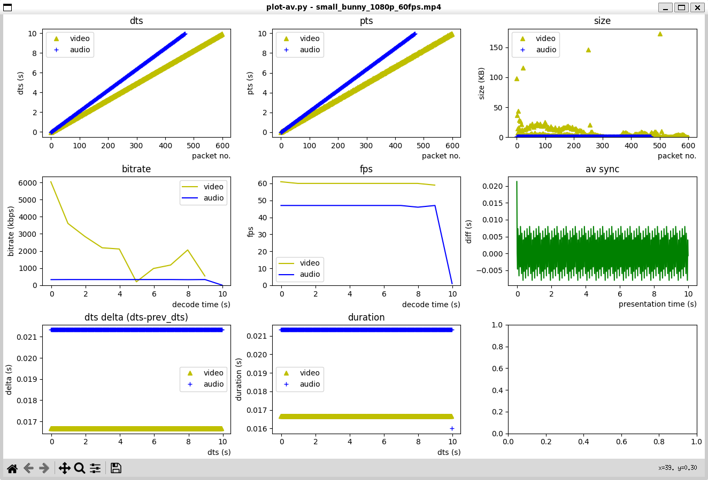

[](https://github.com/wangyoucao577/plot-av/actions/workflows/build_publish.yml) [](https://badge.fury.io/py/plot-av)

# plot-av
Plot details of Audio/Video streams of media files to help you gain better insights of them.      




## Installation 

```bash
$ pip install plot-av
```

## Usage

```bash
# basic use
$ plot-av -i test.mp4


# help 
$ plot-av -h
usage: plot-av [-h] -i INPUT [-vn | -an | -map STREAMS_SELECTION] [--dpi DPI] [--plots PLOTS] [--interval INTERVAL] [--log LOGLEVEL]

plot audio/video streams.

options:
  -h, --help            show this help message and exit
  -i INPUT              input file url (default: None)
  -vn                   disable video stream (default: False)
  -an                   disable audio stream (default: False)
  -map STREAMS_SELECTION
                        manually select streams, pattern 'input_index:stream_type:stream_index', e.g. '0:v:0', '0:a:0' (default: None)
  --dpi DPI             resolution of the figure. If not provided, defaults to 100 by matplotlib. (default: None)
  --plots PLOTS         subplots to show, seperate by ','. options: dts,pts,size,bitrate,fps,avsync,dts_delta,duration (default: dts,pts,size,bitrate,fps,avsync,dts_delta,duration)
  --interval INTERVAL   calculation interval in seconds for statistics metrics, such as bitrate, fps, etc. (default: 1.0)
  --log LOGLEVEL        log level (default: None)
```

### More examples

- Draw your interested subplots only

```bash
$ plot-av -i test.mp4 --plots dts,pts
```

- Draw video or audio only 

```bash
# disable video
$ plot-av -i test.mp4 -vn

# disable audio
$ plot-av -i test.mp4 -an
```

- Manually select streams from mutiple inputs

```bash
$ plot-av -i test1.mp4 -i test2.mp4 -map 0:v:0 -map 1:a:0 
```

